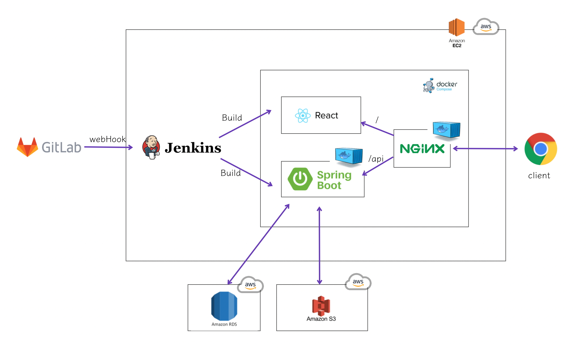
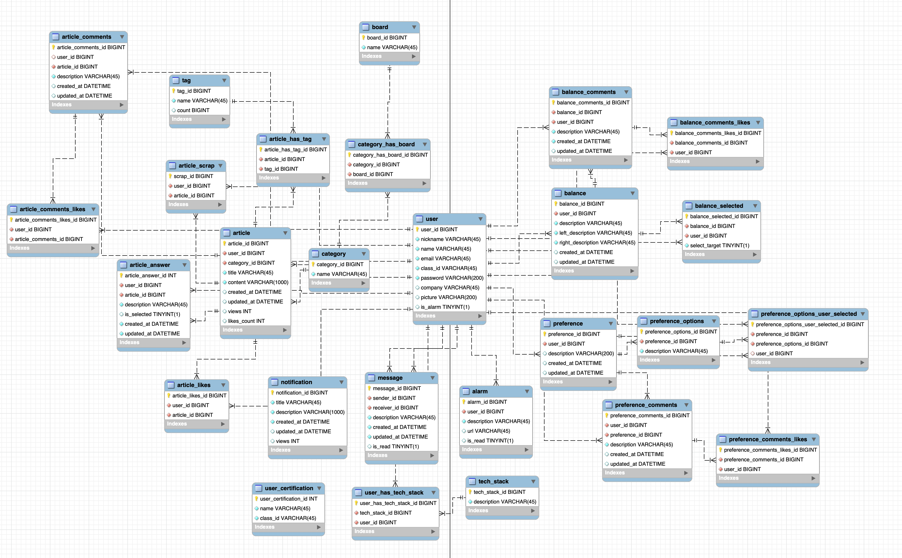

싸피인의 소통을 위한 커뮤니티 서비스
<br><br>


## 프로젝트 소개 및 기능

저희 프로젝트는 싸피인의 소통을 위한 커뮤니티 서비스입니다

주요 기능은 게시판, 투표, 모임 기능입니다. 이러한 기능을 통해 싸피인들에게 지속적인 교류활동과 다양한 네트워크를 형성할 수 있는 공간을 마련하고자 합니다.
<br><br>


<br>

## 기대효과

- 동기 및 선후배간 네트워크 활성화
- 싸피 수료 후에도 지속적인 유대감 형성
- 선호도 조사를 통한 개발직군의 분위기 파악 용이
- 함께할 프로젝트 팀원 모집 시 용이
<br><br>


<br>

## 주요 기능

- 게시판
    - 자유게시판
    - 질문게시판
    - 꿀팁게시판
- 놀이터
    - 밸런스 게임
    - 선호도 조사
    <br><br>


<br>

# 팀원소개

```
강동석: 팀장, BE, 선호도조사

정언용: FE, 회원관리
김종우: FE, 공지사항, 게시판

박소율: BE, 게시판
임형준: BE, 밸런스게임, CI/CD
최정민: BE, 회원관리, CI/CD
```
<br><br>

<br>


# 기술 스택

<br>

#### **Front-End**

  


#### Back-End


#### CI/CD


#### 협업툴


<br>

## 시스템 구성도


<br><br>

<br>

# ERD 및 테이블 소개



1. 사용자 정보를 저장하는 `User` 테이블
2. 사용자 간 메시지를 저장하기 위한 `Message` 테이블
3. 사용자가 쓴 게시글에 달린 덧글이나 좋아요의 기록을 저장하기 위한 `Alarm` 테이블
4. 자유게시판, 질문게시판, 꿀팁게시판을 분류하기 위한 `Board` 테이블
5. 게시글 작성 시 카테고리 선택을 위한 `Category` 테이블(ex. CS지식, 알고리즘)
6. 해시태그를 위한 `Tag` 테이블(ex. Python, java, javascript)
7. 선호도 조사를 위한 `Preference` 테이블
    1. 선호도 조사 선택지를 저장하기 위한 `PreferenceOptions` 테이블
    2. 유저가 선택한 선호도 조사 선택지를 저장하기 위한 `PreferenceOptionsUserSelected` 테이블
    3. 선호도 조사 덧글을 저장하기 위한 `PreferenceComments` 테이블
    4. 선호도 조사 덧글 좋아요를 위한 `PreferenceCommentsLikes` 테이블
8. 밸런스 게임을 위한 `Balance` 테이블
    1. 유저가 선택한 선호도 조사 선택지를 저장하기 위한 `BalanceSelected` 테이블
    2. 선호도 조사 덧글을 저장하기 위한 `BalanceComments` 테이블
    3. 선호도 조사 덧글 좋아요를 위한 `BalanceCommentsLikes` 테이블
9. 싸피생 인증을 위한 교육생 정보가 저장된 `UserCertification` 테이블
10. 공지사항을 저장하기 위한 `Notification` 테이블
<br><br>


<br>

# 기능 상세 설명

[API 명세서](https://documenter.getpostman.com/view/11279067/UyxbsAPd)

<br>

## 회원

### 회원 인증

- 회원 가입(싸피생 인증, 이메일 인증, 닉네임 중복 검사, 비밀번호 확인)
- 로그인
- 토큰 및 유저 정보 localStorage 저장

### 회원 관리

- 프로필 조회
- 기술 스택 및 회사 검색
- 회원 정보 수정, 비밀번호 변경
- 알람 및 쪽지
- 회원 검색 및 탈퇴

<br>

## 게시판

### 자유 게시판

- 게시글 생성, 삭제, 수정
    - 댓글 기능
    - 좋아요 기능

### 꿀팁 게시판

- 게시글 생성, 삭제, 수정

> 질문 게시판은 추후 구현 예정

<br>

## 밸런스게임

- 밸런스 게임 생성, 삭제
    - 밸런스 게임 투표에 따른 투표 결과 반환

<br>

## 선호도조사

- 선호도조사 생성, 삭제
- 원형그래프를 통해 투표 결과를 한 눈에 파악
- 선호도조사 질문 검색

<br><br>


# 폴더 구조

##### Back-end

```
📦backend
 ┣ 📂src
 ┃ ┣ 📂main
 ┃ ┃ ┣ 📂java
 ┃ ┃ ┃ ┗ 📂a204
 ┃ ┃ ┃ ┃ ┗ 📂ssayeon
 ┃ ┃ ┃ ┃ ┃ ┣ 📂api
 ┃ ┃ ┃ ┃ ┃ ┃ ┣ 📂controller
 ┃ ┃ ┃ ┃ ┃ ┃ ┣ 📂request
 ┃ ┃ ┃ ┃ ┃ ┃ ┃ ┣ 📂article
 ┃ ┃ ┃ ┃ ┃ ┃ ┃ ┣ 📂auth
 ┃ ┃ ┃ ┃ ┃ ┃ ┃ ┣ 📂balance
 ┃ ┃ ┃ ┃ ┃ ┃ ┃ ┣ 📂notification
 ┃ ┃ ┃ ┃ ┃ ┃ ┃ ┣ 📂preference
 ┃ ┃ ┃ ┃ ┃ ┃ ┃ ┗ 📂user
 ┃ ┃ ┃ ┃ ┃ ┃ ┣ 📂response
 ┃ ┃ ┃ ┃ ┃ ┃ ┃ ┣ 📂article
 ┃ ┃ ┃ ┃ ┃ ┃ ┃ ┣ 📂auth
 ┃ ┃ ┃ ┃ ┃ ┃ ┃ ┣ 📂balance
 ┃ ┃ ┃ ┃ ┃ ┃ ┃ ┣ 📂notification
 ┃ ┃ ┃ ┃ ┃ ┃ ┃ ┣ 📂preference
 ┃ ┃ ┃ ┃ ┃ ┃ ┃ ┗ 📂user
 ┃ ┃ ┃ ┃ ┃ ┃ ┗ 📂service
 ┃ ┃ ┃ ┃ ┃ ┣ 📂common
 ┃ ┃ ┃ ┃ ┃ ┃ ┣ 📂exceptions
 ┃ ┃ ┃ ┃ ┃ ┃ ┃ ┣ 📂handler
 ┃ ┃ ┃ ┃ ┃ ┃ ┗ 📂model
 ┃ ┃ ┃ ┃ ┃ ┃ ┃ ┣ 📂enums
 ┃ ┃ ┃ ┃ ┃ ┃ ┃ ┗ 📂response
 ┃ ┃ ┃ ┃ ┃ ┣ 📂config
 ┃ ┃ ┃ ┃ ┃ ┃ ┣ 📂auth
 ┃ ┃ ┃ ┃ ┃ ┃ ┣ 📂aws
 ┃ ┃ ┃ ┃ ┃ ┃ ┣ 📂jwt
 ┃ ┃ ┃ ┃ ┃ ┣ 📂db
 ┃ ┃ ┃ ┃ ┃ ┃ ┣ 📂entity
 ┃ ┃ ┃ ┃ ┃ ┃ ┃ ┣ 📂article
 ┃ ┃ ┃ ┃ ┃ ┃ ┃ ┣ 📂balance
 ┃ ┃ ┃ ┃ ┃ ┃ ┃ ┣ 📂notification
 ┃ ┃ ┃ ┃ ┃ ┃ ┃ ┣ 📂preference
 ┃ ┃ ┃ ┃ ┃ ┃ ┃ ┣ 📂user
 ┃ ┃ ┃ ┃ ┃ ┃ ┗ 📂repository
 ┃ ┃ ┃ ┃ ┃ ┃ ┃ ┣ 📂Notification
 ┃ ┃ ┃ ┃ ┃ ┃ ┃ ┣ 📂article
 ┃ ┃ ┃ ┃ ┃ ┃ ┃ ┣ 📂preference
 ┃ ┃ ┃ ┃ ┃ ┃ ┃ ┣ 📂user
 ┃ ┃ ┗ 📂resources
 ┣ 📜Dockerfile
 ┗ 📜build.gradle
```

#### Front-end

```
📦frontend
 ┣ 📂nginx
 ┃ ┗ 📜default.conf
 ┣ 📂public
 ┃ ┣ 📜background.jpeg
 ┃ ┣ 📜index.html
 ┃ ┣ 📜manifest.json
 ┃ ┗ 📜robots.txt
 ┣ 📂src
 ┃ ┣ 📂components
 ┃ ┃ ┣ 📂common
 ┃ ┃ ┣ 📂images
 ┃ ┃ ┣ 📂main
 ┃ ┃ ┃ ┣ 📂accounts
 ┃ ┃ ┃ ┣ 📂balance
 ┃ ┃ ┃ ┃ ┗ 📂css
 ┃ ┃ ┃ ┣ 📂boards
 ┃ ┃ ┃ ┃ ┣ 📂frees
 ┃ ┃ ┃ ┃ ┣ 📂notice
 ┃ ┃ ┃ ┃ ┣ 📂polls
 ┃ ┃ ┃ ┃ ┣ 📂qna
 ┃ ┃ ┃ ┃ ┗ 📂tips
 ┃ ┃ ┃ ┣ 📂preference
 ┃ ┃ ┃ 📂search
 ┃ ┣ 📂services
 ┃ ┣ 📂user
 ┃ ┣ 📜App.js
 ┃ ┣ 📜index.css
 ┃ ┣ 📜index.js
 ┃ ┣ 📜reportWebVitals.js
 ┃ ┣ 📜serviceWorker.js
 ┃ ┣ 📜setupTests.js
 ┃ ┗ 📜store.js
 ┣ 📜.env
 ┣ 📜.gitignore
 ┣ 📜Dockerfile
 ┣ 📜README.md
 ┣ 📜package-lock.json
 ┗ 📜package.json
```
<br><br>


## 저희는 노션으로 소통했어요!

[노션링크](https://pickle-calliandra-e19.notion.site/SSAYEON-SSA-cdab675594be41d1964f56f2eadd7e8f)
